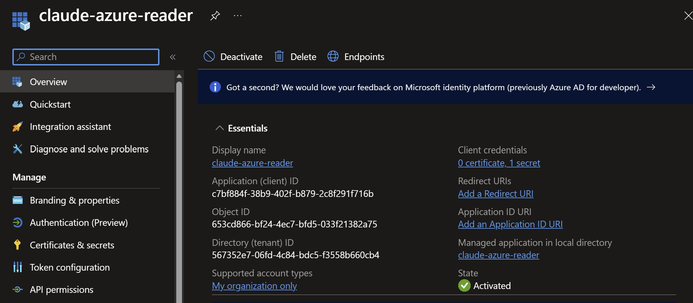
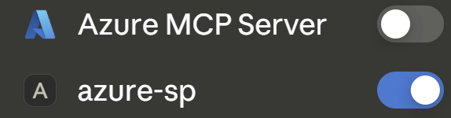

# Least-privilege AI access to Azure: Claude Desktop + Azure MCP Server + app registration

This repo documents connecting an AI agent to a live Azure environment with scoped read access: a service principal holding Reader on a single resource group, wired into the Azure MCP Server running under Claude Desktop, then tested to prove both
what it can do and what it can't.

The design premise: an AI is just another workload identity, and how autonomously it operates is irrelevant to how it should be secured. Whether a human approves every tool call or the model chains its own, Entra ID authenticates the same identity and ARM evaluates the same role assignment on every request. Local controls shape what gets attempted; they never change what is permitted. This setup is built so the only layer that must hold is the one no local compromise can reach.

Every stage of the chain still carries its own controls: the MCP host (tool approval required, write/delete tools disabled), the MCP server (`--read-only` at launch), and the cloud (a service principal with Reader at resource group scope, evaluated per request). Defense in depth across all three, with enforcement deliberately placed in the one layer local access can't reach.

## Concept and Design

### Terminology

- **The model.** Claude itself, running remotely on Anthropic's API. It sees tool definitions, emits tool calls, reads tool results. It never sees the config file, the environment block or the secret.
- **The MCP host.** Claude Desktop, a local user-level process running as the signed-in user. It reads the config, spawns the MCP server as a child process and injects the credentials into that child's environment. The tool approval prompt and the disabled write tools live here.
- **The MCP server.** [Azure MCP Server](https://github.com/microsoft), a local program the host launches and talks to over stdio. It translates the model's tool calls into real API requests against ARM, using the service principal's token. "Server" means the side that answers requests, not a process listening on the network.
- **The cloud services.** Microsoft Entra ID authenticates the service principal and issues the access token. Azure Resource Manager (ARM) evaluates the role assignment per request and decides what that identity can actually do. Two separate jobs, kept separate throughout.

Two things are called "read only" and they are not the same control:

- **`--read-only`** is a launch flag on the MCP server. Local, advisory, undone by anyone who can edit the config.
- **Reader** is the RBAC role assigned to the service principal. Service-side, authoritative, evaluated by ARM on every request.

### Design decisions

**Azure RBAC as enforcement, everything local as defense in depth:** the MCP server's `--read-only` flag and the host's disabled tools limit what can be attempted, but anyone who can edit the config on the machine can undo both. The service-side Reader assignment is what guarantees ARM rejects writes, making it the control this setup relies on; the local restrictions stay on as defense in depth.

**App registration / service principal:** follows from the above. The Azure MCP Server falls back to Azure CLI credentials if nothing else is configured, which could grant the AI whatever the signed-in user holds, and potentially include write/delete permissions. A dedicated workload identity removes that risk.

**Reader scoped to a resource group, not tenant, management group or subscription:** the smallest scope that serves the purpose in this scenario. Requests outside it fail by design, and out-of-scope resources are filtered from results, invisible to the model.

### Architecture


The flow from prompt to Azure and back: model > host > server > cloud.

```
THE MODEL ─ Claude (remote, Anthropic API)
    │  sees tool definitions, emits tool calls, reads tool results
    │  never sees the config file, the env block or the secret
    ▼  tool call
MCP HOST ─ Claude Desktop (local user-level process, runs as you)
    │  tool approval prompt; write/delete tools disabled
    │  reads config from disk, injects env block into the process it spawns
    ▼  spawn (child inherits env)
MCP SERVER ─ Azure MCP Server (local child process, --read-only)
    │  credential chain (EnvironmentCredential) → client credentials flow
    │
═══════════ authoritative boundary═══════════
    │
    ▼
CLOUD SERVICE ─ Microsoft Entra ID
    │  authenticates the "claude-azure-reader" service principal
    │  issues OAuth 2.0 access token (JWT); the token carries identity, not scope
    │                       └──► service principal sign-in logs
    ▼  bearer token
CLOUD SERVICE ─ Azure Resource Manager
    │  evaluates the role assignment per request: Reader on one resource group
    ├──► reads inside the resource group: allowed
    ├──► writes: AuthorizationFailed
    └──► outside the resource group: filtered from results, invisible

results travel back up the same path, ARM → server → host → model, carrying
data only; no credentials cross back into the model's context
```

The model never sees the credentials; tool calls and tool results carry no secrets. The secret does exist at rest on the machine. The MCP host reads it from its config and injects it into the environment of the child process it spawns. What no part of the local chain can do is change what that identity is allowed to do. The `--read-only` flag and the disabled write tools are defense in depth, and anyone who can edit the config can undo both. The authoritative boundary is elsewhere: ARM evaluates RBAC per request against the identity Entra authenticated. A manipulated model or a compromised host changes what is attempted, never what is permitted. Even the secret itself, stolen and used from another machine entirely, carries nothing beyond Reader on one resource group.

Traffic flow: prompts and tool results travel between the MCP host and Anthropic's API over TLS; tool execution happens locally, with the MCP server calling Entra and ARM over HTTPS. The model never talks directly to Azure and Azure never talks directly to Anthropic; the only bridge is tool results passing back through the host, and credentials never leave the machine.

### Security layers

Four layers:

1. **Tool approval on the MCP host.** With the current permissions configured on the Azure MCP Server, the host asks before running tools.
2. **`--read-only` on the MCP server launch.** Write/delete tools are never exposed to the model. But it lives in a local config file, so it's hygiene, not enforcement.
3. **RBAC: Reader at resource group scope.** The actual control. ARM evaluates it per request on the service side, and no local misconfiguration can override it.
4. **Audit: Entra sign-in logs and the ARM Activity Log.** Doesn't prevent anything, but makes the identity's entire footprint observable.

The point: layers 1 and 2 are advisory and live on the local machine, where they can fail or be tampered with. Layer 3 is authoritative and is evaluated by ARM on every request. Designed so that the only layer that must hold is the service principal's permissions being correct.

## Workflow / Steps

### On the cloud service: identity, scope and permissions

Create the app registration, service principal and role assignment:

```powershell
az ad sp create-for-rbac `
  --name "claude-azure-reader" `
  --role "Reader" `
  --scopes /subscriptions/<subscription-id>/resourceGroups/<resource-group>
```

The output contains `appId`, `password` and `tenant`. These are the three values the MCP server authenticates with (save it for later).

The service principal is now visible in Entra:


And the role is visible on the RG:


### MCP server: configuration and launch restrictions

*Note: First attempt was the Azure MCP Server extension in Claude Desktop with the credentials stored as Windows user-level environment variables. That fails by design: the host launches extension-managed servers with a sanitized environment, so the variables never reach the server process, `EnvironmentCredential` finds nothing, and the credential chain falls through toward interactive login. The extension's own settings panel offered no workable way to supply them either. Full diagnosis in [Troubleshooting.md](Troubleshooting.md).*

The working setup is a manual server entry in `%APPDATA%\Claude\claude_desktop_config.json`, pointing at the extension's own `azmcp.exe`, where the `env` block guarantees the child process sees exactly these three variables:

```json
{
  "mcpServers": {
    "azure-sp": {
      "command": "C:\\Users\\<user>\\AppData\\Roaming\\Claude\\Claude Extensions\\local.mcpb.microsoft.azure.mcp.server\\server\\azmcp.exe",
      "args": ["server", "start", "--read-only"],
      "env": {
        "AZURE_TENANT_ID": "<tenant-id>",
        "AZURE_CLIENT_ID": "<sp-client-id>",
        "AZURE_CLIENT_SECRET": "<secret-value>"
      }
    }
  }
}
```

Fully restart the host afterwards (quit from the system tray, not just the window); it reads the config at launch. Disable the extension so only the manual entry runs.

The `--read-only` launch arg is the first local control on top of RBAC: it stops the server from exposing write tools to the model at all.

### MCP host: tool restrictions

Second local control: all write/delete tools are explicitly disabled in Claude Desktop's tool permissions, so even a tool the server did expose could not run:


Both are advisory: they limit what can be attempted, not what is permitted. Permissions are enforced by the Reader role assignment on the service side, where ARM rejects any write regardless of local configuration.

### Testing

Setup during testing: the manual `azure-sp` entry is the only Azure connector enabled in the MCP host, so every call runs through the service principal and nothing else.


#### 1. Verify the identity outside the MCP host

Before attributing any failure to the MCP layer, prove the service principal works on its own. Sign in as the service principal and list resources in the scoped resource group:

```powershell
az login --service-principal -u $env:AZURE_CLIENT_ID -p $env:AZURE_CLIENT_SECRET --tenant $env:AZURE_TENANT_ID;
az resource list -g <resource-group> --subscription <subscription-id> -o table;
az logout;
az login
```


Verify the identity holds what was granted:

```powershell
az role assignment list --assignee (az ad sp list --display-name "claude-azure-reader" --query "[0].appId" -o tsv) --all -o table
```

Expected output is:

```
Principal   Role    Scope
----------  ------  --------------------------------------------------------------------------
<app-id>    Reader  /subscriptions/<subscription-id>/resourceGroups/<resource-group>
```

Drift can be removed with `az role assignment delete`.

#### 2. Confirm reads work through the model

Prompt: *"List NSGs in our Azure subscription."*

The model queries the environment through the MCP server and tries to enumerate the whole subscription. Because the identity holds Reader on a single resource group, the results come back with only the NSG in `<resource-group>`, while another resource group in the same subscription holds two more. Consistent with the scope that was set: the one resource group is all this identity can see.


The resource group and NSGs that stay invisible to the model:


#### 3. Confirm the write path is blocked, and that enforcement is service-side

Prompt: *"Create a network security group called nsg1."* Run with
`--read-only` active, and one run shows both layers.

The server exposes no creation tools, so a real write cannot even be attempted. The closest available operation is a deployment preview (what-if), which the server exposes since it changes nothing in Azure. The model tries it, and ARM rejects it with AuthorizationFailed: even a what-if requires write-level permissions, and Reader does not carry them. The model reports the missing permission and offers the CLI command for running the deployment manually.

Two layers visible in one test: the `--read-only` flag stopped any real write from existing as a tool (layer 2), and ARM denied even the preview on the service side (layer 3). The second denial is the one nothing local can change.


### Audit trail

- **Service principal sign-in logs** (Entra > Monitoring & health > Sign-in logs > Service principal sign-ins, requires Entra ID P1): one entry per token acquisition, whether the model queried through the MCP server or the CLI signed in. Every token issued to the identity, in one place.
- **After first use:** confirm in the sign-in logs that calls came from `claude-azure-reader`, not the user account. Proof the sequencing worked, not just the assumption.


### Operational notes

- The client secret sits in plain text in `claude_desktop_config.json`, readable by any process running as the signed-in user. Acceptable for a lab identity with Reader on one resource group, nothing more. Rotate periodically: `az ad app credential reset --id <app-id>`. Keep the file out of any repo or screen share.
- A secret that leaks anywhere (chat, repo, screen share) gets rotated immediately. Assume compromise rather than debating it.
- `az role assignment list --assignee <app-id> --all -o table` shows every grant the service principal holds. Run periodically to catch drift, such as leftover assignments from earlier setup attempts.

See [SecurityNotes.md](SecurityNotes.md) for general security notes, data security risks and what the setup would look like outside a lab environment. 
See [Troubleshooting.md](Troubleshooting.md) for more details on faced issues during setup and steps done to resolve them.