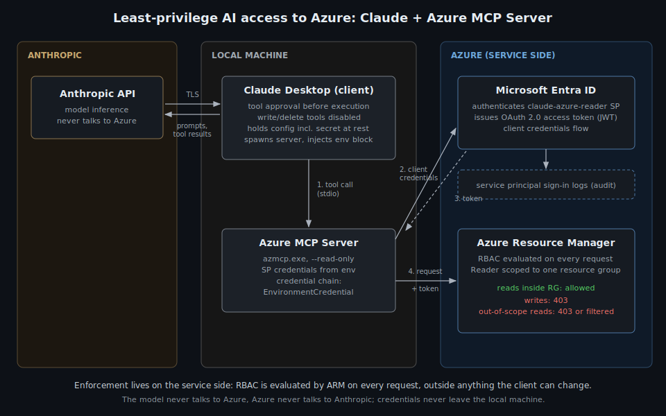
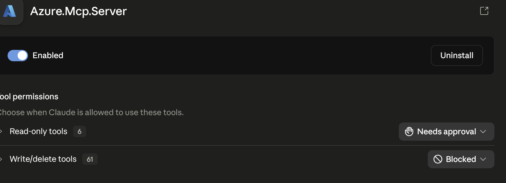
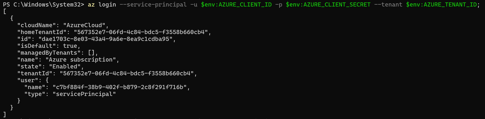
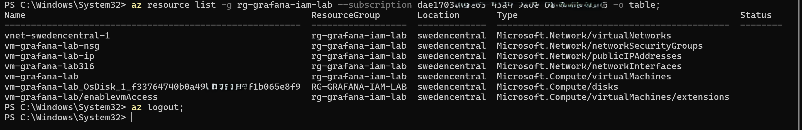
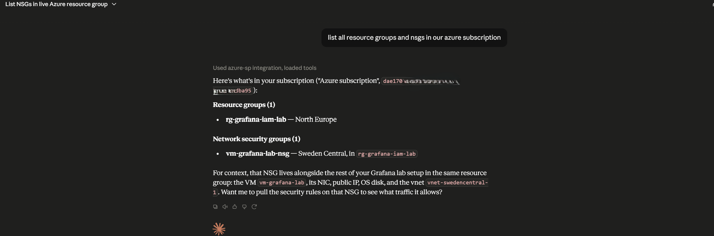
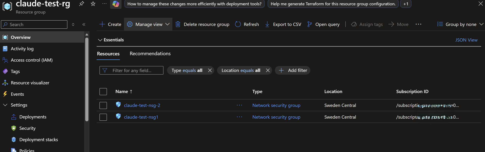
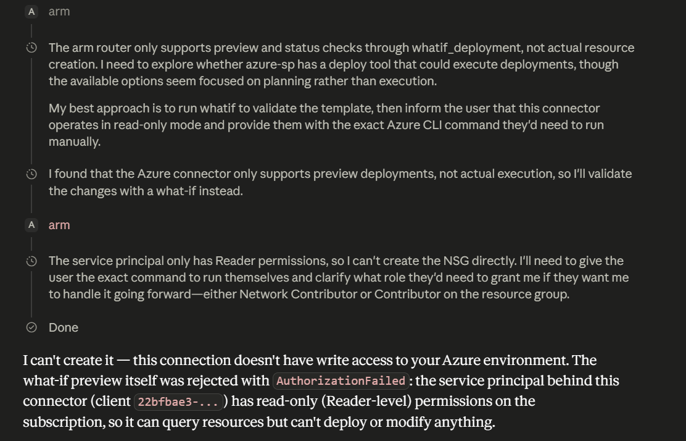
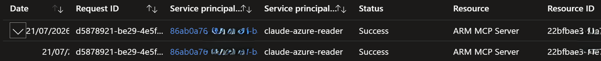

# Least-privilege AI access to Azure: Claude + Azure MCP Server

This repo documents connecting an AI to a live Azure environment with scoped read access: a service principal scoped to a single resource group with Reader only, wired into the Azure MCP Server in Claude Desktop, then tested to prove both what it can do and what it can't.

The design premise: an AI is just another workload identity, and how autonomously it operates is irrelevant to how it should be secured. Whether a human approves every tool call or the model chains its own, the service side (Azure/Entra ID) evaluates the same identity against the same RBAC on every request. Client-side controls become less important since the enforcement layer doesn't move. This setup is built so the only layer that must hold is the one the client can't touch.

Every stage of the chain still carries its own restriction: the AI client (tool approval, write/delete tools disabled), the MCP server (`--read-only` at launch), and the cloud (Reader at RG scope, evaluated per request). Defense in depth across all three, with enforcement deliberately placed in the one layer no local compromise can reach.

## Concept

### Design decisions

- **Azure RBAC as enforcement, everything local as defense in depth:** the MCP server `--read-only` flag and the Claude client's disabled tools limit what can be attempted but can be changed by anyone who obtains config access. The service-side Reader role is what guarantees ARM rejects writes, making it the control this setup relies on; the local restrictions stay on as defense in depth.
- **Service principal, not a user principal:** follows from the above. The MCP server falls back to Azure CLI credentials if nothing else is configured, which would grant whatever the signed-in user holds, potentially including write/delete rights. A dedicated app registration / service principal removes this risk and makes the enforced scope exactly the granted scope.
- **Reader scoped to RG level, not tenant, MG or subscription:** the smallest scope that serves the purpose. Queries outside the scope fail by design; anything beyond the RG is invisible to the client.

### Architecture



The flow from prompt to Azure and back, client- to server- to service-side:

```
CLIENT ─ Claude Desktop
    │  tool approval, write/delete tools disabled
    │  spawns local process, injects the env block from its config
    ▼
MCP SERVER ─ Azure MCP Server (local, --read-only)
    │  credential chain (EnvironmentCredential) → client credentials flow
    ▼
SERVICE SIDE ─ Microsoft Entra ID
    │  authenticates the identity, issues OAuth 2.0 access token (JWT) for "claude-azure-reader" SP
    │                       │
    │                       └──► Service principal sign-in logs
    ▼
SERVICE SIDE ─ Azure Resource Manager
    │  evaluates RBAC per request against the token
    ├──► reads inside <resource-group>: allowed
    └──► writes: 403; out-of-scope reads: 403 or filtered from results
```

The model never sees the credentials. They live in the local config and in the environment of the MCP server process; tool calls and tool results carry no secrets. To be precise: Claude Desktop does hold the secret at rest, since it reads the config and injects the env block into the process it spawns. What it cannot do is change what that identity is allowed to do. Everything the MCP server executes is bounded by the token Entra issues to the service principal, so enforcement sits on the service side, between the MCP server and ARM, not anywhere inside the AI layer: a manipulated model or compromised client changes what is attempted, never what is permitted. Even a stolen secret, used from another machine entirely, holds nothing beyond Reader on one resource group.

Traffic flow: prompts and tool results travel between Claude Desktop and Anthropic's API over TLS; tool execution happens locally, with the MCP server calling Entra and ARM over HTTPS. The model never talks to Azure and Azure never talks to Anthropic; the only bridge is tool results passing through the local process, and credentials never leave the machine.

### Security layers

Four layers, from weakest to strongest:

1. **Tool approval in Claude Desktop.** With the current permissions configured on the Azure MCP server in Claude, the client asks before running tools.
2. **`--read-only` on the MCP server launch.** Write/delete tools are never exposed to the model. But it lives in a local config file, so it's hygiene, not enforcement.
3. **RBAC: Reader at RG scope.** The actual control. ARM evaluates it server-side on every request, and no local misconfiguration can override it.
4. **Audit: sign-in logs and Activity Log.** Doesn't prevent anything, but makes the identity's entire footprint observable.

The point: layers 1 and 2 live on the local machine and can fail or be tampered with. Layer 3 lives in Azure/Entra. Designed so that the only layer that must hold is the service principal's permissions being correct.

## Proof of concept

### Service side: identity, scope and permissions

The Azure MCP Server [microsoft/mcp](https://github.com/microsoft/mcp). An MCP server is a local program the AI client launches and talks to over stdio; it translates the model's tool calls into real API requests, here against ARM using the service principal's token. "Server" means the side that answers requests, not a process listening on the network.

Create the app registration, service principal and role assignment in one command:

```powershell
az ad sp create-for-rbac `
  --name "claude-azure-reader" `
  --role "Reader" `
  --scopes /subscriptions/<subscription-id>/resourceGroups/<resource-group>
```

The output contains `appId`, `password` and `tenant`. These are the three values the MCP server authenticates with.

### MCP server: configuration and launch restrictions

First attempt was the Azure MCP Server extension in Claude Desktop with the credentials stored as Windows user-level environment variables. That fails by design: Claude Desktop launches extension-managed servers with a sanitized environment, so the variables never reach the server process, `EnvironmentCredential` finds nothing, and the credential chain falls through toward interactive login. The extension's own settings panel offered no workable way to supply them either. Full diagnosis in [TROUBLESHOOTING.md](TROUBLESHOOTING.md).

The working setup is a manual server entry in `%APPDATA%\Claude\claude_desktop_config.json`, pointing at the extension's own `azmcp.exe`, where the `env` block guarantees the process sees exactly these three variables:

```json
{
  "mcpServers": {
    "azure-sp": {
      "command": "C:\\Users\\<user>\\AppData\\Roaming\\Claude\\Claude Extensions\\local.mcpb.microsoft.azure.mcp.server\\server\\azmcp.exe",
      "args": ["server", "start", "--read-only"],
      "env": {
        "AZURE_TENANT_ID": "<tenant-id>",
        "AZURE_CLIENT_ID": "<sp-client-id>",
        "AZURE_CLIENT_SECRET": "<secret-value>"
      }
    }
  }
}
```

Fully restart Claude Desktop afterwards (quit from the system tray, not just the window); it reads the config at launch. Disable the extension so only the manual entry runs.

The `--read-only` launch arg is the first local control on top of RBAC: it stops the server from exposing write tools to the model at all.

### Client side: tool restrictions

Second local control: all write/delete tools are explicitly disabled in Claude Desktop's tool permissions, so even a tool the server did expose could not run:



Both are local controls: they limit what can be attempted, not what is permitted. Permissions are enforced by the Reader role on the service side, where ARM rejects any write regardless of local configuration.

### Testing

Setup during testing: the manual `azure-sp` entry is the only Azure connector enabled in Claude Desktop, so every call runs through the service principal and nothing else.

#### 1. Verify the identity outside Claude

Before attributing any failure to the MCP layer, prove the SP works on its own. Sign in as the service principal and list resources in the scoped RG:

```powershell
az login --service-principal -u $env:AZURE_CLIENT_ID -p $env:AZURE_CLIENT_SECRET --tenant $env:AZURE_TENANT_ID;
az resource list -g <resource-group> --subscription <subscription-id> -o table;
az logout;
az login
```




Verify the identity holds what was granted:

```powershell
az role assignment list --assignee (az ad sp list --display-name "claude-azure-reader" --query "[0].appId" -o tsv) --all -o table
```

Expected output is:

```
Principal   Role    Scope
----------  ------  --------------------------------------------------------------------------
<app-id>    Reader  /subscriptions/<subscription-id>/resourceGroups/<resource-group>
```

Drift can be removed with `az role assignment delete`.

#### 2. Confirm reads work through Claude

Prompt: *"List NSGs in our Azure subscription."*

Claude queries the environment through the MCP server and tries to enumerate the entire subscription, since it only has read access on a single RG it returns only a NSG in rg-grafana-iam-lab. While in reality there is another RG in the same subscription containing 2 other NSGs. Which is consistent with the scope set, since the one RG is all this identity can see.



The NSGs and RG invisible to Claude:


#### 3. Confirm the write path is blocked, and that enforcement is service-side

Prompt: *"Create a network security group called nsg1."* Run with
`--read-only` active, and one run shows both layers.

The server exposes no creation tools, so a real write cannot even be
attempted. The closest available operation is a deployment preview
(what-if), which the server exposes since it changes nothing in Azure.
Claude tries it, and ARM rejects it with AuthorizationFailed: even a
what-if requires write-level permissions, and Reader does not carry them.
Claude reports the missing permission and offers the CLI command for
running the deployment manually.

Two layers visible in one test: the read-only flag stopped any real write
from existing as a tool (layer 2), and RBAC denied even the preview on the
service side (layer 3). The second denial is the one nothing local can
change.



### Audit trail

- **Service principal sign-in logs** (Entra > Monitoring & health > Sign-in logs > Service principal sign-ins, requires Entra ID P1): one entry per token acquisition, whether Claude queried through the MCP server or the CLI signed in. Every token issued to the identity, in one place.
- **After first use:** confirm in the sign-in logs that calls came from `claude-azure-reader`, not the user account. Proof the sequencing worked, not just the assumption.



### Operational notes

- The client secret sits in plain text in `claude_desktop_config.json`, readable by any process running as the signed-in user. Acceptable for a lab identity with Reader on one RG, nothing more. Rotate periodically: `az ad app credential reset --id <app-id>`. Keep the file out of any repo or screen share.
- A secret that leaks anywhere (chat, repo, screen share) gets rotated immediately. Assume compromise rather than debating it.
- `az role assignment list --assignee <app-id> --all -o table` shows every grant the SP holds. Run periodically to catch drift, such as leftover assignments from earlier setup attempts.

## Data security posture

Enforcement controls what the identity can do; data posture controls what the model provider sees. Only the first is solved by RBAC, and the two degrade independently. This setup is acceptable for a lab on both counts, not universally:

- **What the model sees:** every tool result reaches the model provider: names, configurations, tags, topology. ARM Reader does not return most secret material (Key Vault values need data-plane access, storage keys need listKeys), so exposure is architecture metadata. Residual risk is sloppy habits: connection strings in app settings, credentials in tags or VM extensions.
- **Secret at rest:** plain text in the Claude Desktop config file is readable by any process running as the signed-in user, from which it can authenticate from anywhere. The RBAC scope makes this acceptable, not the storage; at higher privilege this is the first thing to fix.
- **Conversation retention:** chat content may be retained and, depending on plan and settings, used for training. Set privacy settings deliberately; irrelevant for a lab, first question once anything sensitive is readable.
- **Prompt injection:** attacker-influenced content the model reads (e.g. resource tags) enters its context as potential instructions. Scoping, read-only tooling and Reader RBAC is the containment: injected instructions have nothing destructive to invoke.

The posture degrades in a known order as content sensitivity rises: retention settings stop being acceptable first, then plaintext secret storage, then the shared service principal itself. That ordering is the main takeaway.

## What this looks like at enterprise scale

This lab setup translates, but nearly every component gets swapped for a managed equivalent:

- **Identity:** managed identity or workload identity federation instead of a client secret; if secrets are unavoidable, Key Vault with enforced rotation, never plain text config files.
- **Access model:** group-based assignments under Entra ID Governance (access packages, access reviews, PIM for any elevated path); custom roles where Reader is still too broad, e.g. excluding `Microsoft.KeyVault/vaults/read` to block vault enumeration.
- **Scope:** read access at a management group of non-production subscriptions, with production excluded and the boundary enforced by Azure Policy denying role assignments to AI identities at production scopes.
- **Server hosting:** remote MCP server behind Azure API Management; APIM handles the Entra OAuth handshake and Conditional Access, users authenticate as themselves, and audit logs show real names instead of one shared SP. Shared-SP is the right shape for one person, the wrong shape for fifty.
- **Data exposure:** everything the identity can read reaches the model provider, which forces a review of readable content (connection strings, secrets in tags, PII in resource names), a DLP position on AI tooling, and possibly contractual or regional constraints on where inference happens.
- **Monitoring:** Sentinel analytics rules on the AI identity: off-hours auth, unexpected IPs, any write attempt, tokens outside the known pattern. Predictable-by-design behavior makes anomaly detection cheap.

Same three decisions as the lab (dedicated identity, minimal scope, service-side enforcement), with the manual parts replaced by governance that survives turnover and audits. The principle from the intro, that security must not depend on how autonomously the AI operates, is what makes this scale-up safe: agents running without a human in the loop are tolerable precisely because the design never depended on one.
