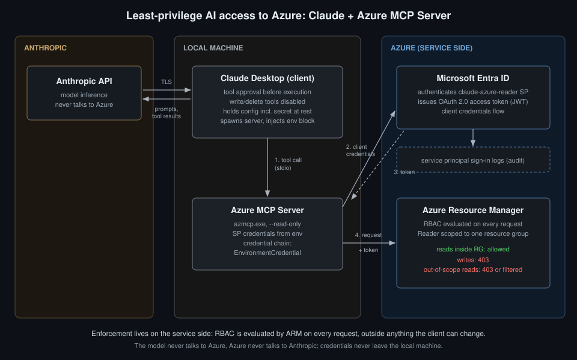
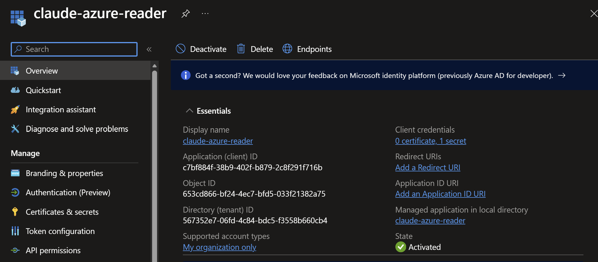
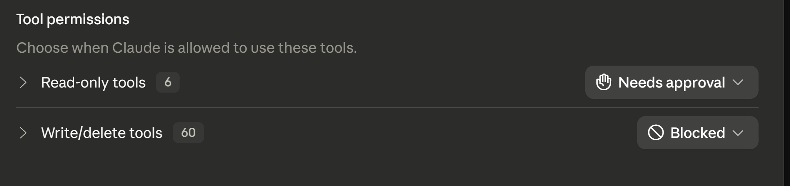
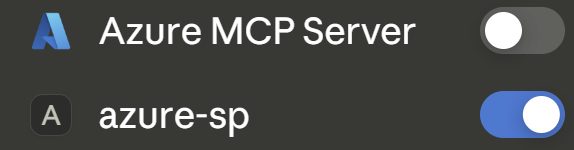
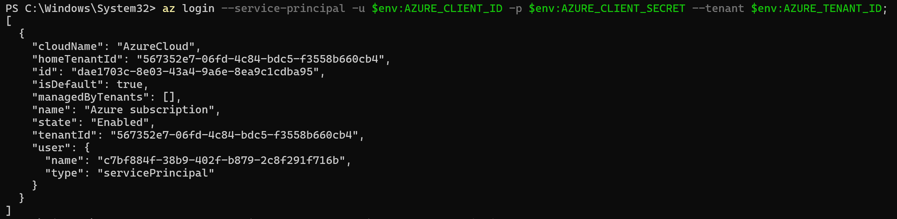
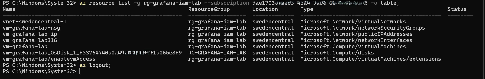
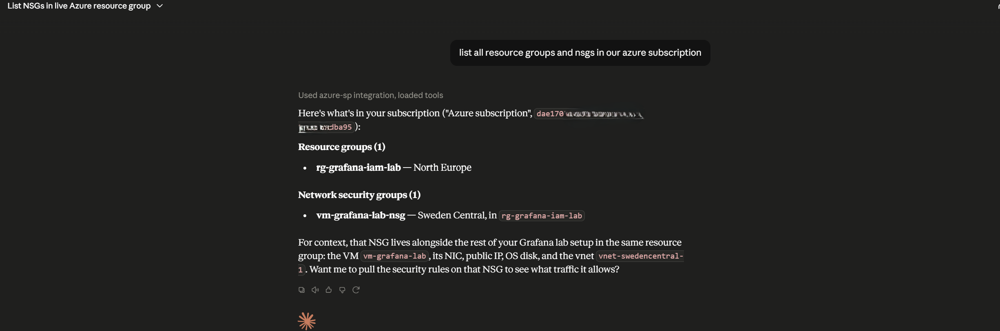
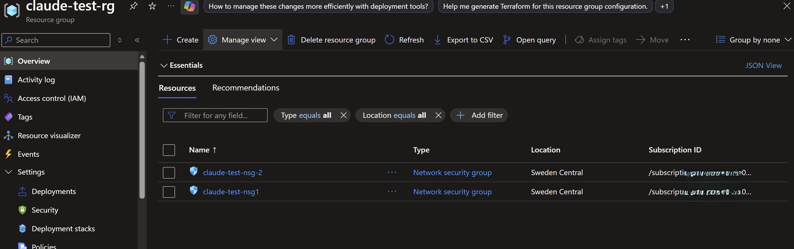
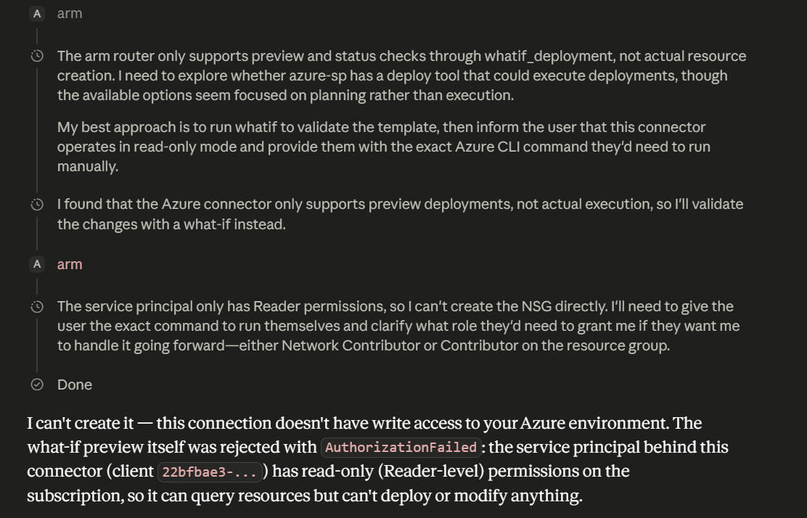
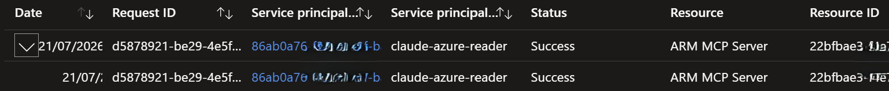

# Least-privilege AI access to Azure: Claude Desktop + Azure MCP Server + app registration

**Built:** a service principal holding Reader on a single resource group, wired into the Azure MCP
Server under Claude Desktop, then tested to prove both what it can do and what it cannot. Reads
inside the scope return data, reads outside it come back empty, and a write attempt is refused by
ARM rather than by anything on the machine.

The premise: an AI is just another workload identity, and how autonomously it operates is irrelevant
to how it should be secured. Whether a human approves every tool call or the model chains its own,
Entra ID authenticates the same identity and ARM evaluates the same role assignment on every request.

## Concept and design

### Terminology

- **The model.** Claude, running remotely on Anthropic's API. It sees tool definitions, emits tool
  calls, reads tool results. It never sees the config file, the environment block or the secret.
- **The MCP host.** Claude Desktop, a local process running as the signed-in user. It reads the
  config, spawns the MCP server as a child process and injects the credentials into that child's
  environment. The tool approval prompt and the disabled write tools live here.
- **The MCP server.** [Azure MCP Server](https://github.com/microsoft), a local program the host
  launches and talks to over stdio. It translates tool calls into API requests against ARM using the
  service principal's token. "Server" means the side that answers requests, not a network listener.
- **The cloud services.** Entra ID authenticates the service principal and issues the token. Azure
  Resource Manager evaluates the role assignment per request. Two separate jobs.

**Two things are called "read only" and they are not the same control.** `--read-only` is a launch
flag on the MCP server: local, advisory, undone by anyone who can edit the config. **Reader** is the
RBAC role on the service principal: service-side, authoritative, evaluated by ARM on every request.
That distinction is what the whole setup is arranged around, and section 3 of the testing proves it.

### Design decisions

**Azure RBAC as enforcement, everything local as defense in depth.** The `--read-only` flag and the
host's disabled tools limit what can be *attempted*. The Reader assignment is what determines what is
*permitted*. Local controls stay on, but the design assumes they can fail.

**A dedicated app registration and service principal.** The Azure MCP Server falls back to Azure CLI
credentials if nothing else is configured, which would hand the AI whatever the signed-in user holds,
potentially including write and delete. A dedicated workload identity removes that.

**Reader scoped to a resource group,** not tenant, management group or subscription. Requests outside
it fail by design, and out-of-scope resources are filtered from results, invisible to the model.

### Architecture



```
THE MODEL ─ Claude (remote, Anthropic API)
    │  sees tool definitions, emits tool calls, reads tool results
    │  never sees the config file, the env block or the secret
    ▼  tool call
MCP HOST ─ Claude Desktop (local user-level process, runs as you)
    │  tool approval prompt; write/delete tools disabled
    │  reads config from disk, injects env block into the process it spawns
    ▼  spawn (child inherits env)
MCP SERVER ─ Azure MCP Server (local child process, --read-only)
    │  credential chain (EnvironmentCredential) → client credentials flow
    │
═══════════ authoritative boundary ═══════════
    │
    ▼
CLOUD SERVICE ─ Microsoft Entra ID
    │  authenticates the "claude-azure-reader" service principal
    │  issues OAuth 2.0 access token (JWT); the token carries identity, not scope
    │                       └──► service principal sign-in logs
    ▼  bearer token
CLOUD SERVICE ─ Azure Resource Manager
    │  evaluates the role assignment per request: Reader on one resource group
    ├──► reads inside the resource group: allowed
    ├──► writes: AuthorizationFailed
    └──► outside the resource group: filtered from results, invisible

results travel back up the same path, ARM → server → host → model, carrying
data only; no credentials cross back into the model's context
```

The secret does exist at rest on the machine, but nothing in the local chain can change what that
identity is allowed to do. A manipulated model or a compromised host changes what is attempted, never
what is permitted, and the secret stolen and used from another machine entirely still carries nothing
beyond Reader on one resource group.

Prompts and tool results travel between the host and Anthropic's API over TLS; tool execution happens
locally, with the MCP server calling Entra and ARM over HTTPS. The model never talks directly to
Azure and Azure never talks directly to Anthropic.

### Security layers

| # | Layer | Where enforced | Strength |
|---|---|---|---|
| 1 | Tool approval prompt | MCP host, local | Advisory |
| 2 | `--read-only` launch flag | MCP server, local | Advisory, undone by editing the config |
| 3 | Reader at resource group scope | ARM, service-side | **Authoritative**, evaluated per request |
| 4 | Entra sign-in logs + ARM Activity Log | Cloud | Detective, prevents nothing |

Layer 3 is the only one that must hold.

## Workflow

### 1. Identity, scope and permissions

```powershell
az ad sp create-for-rbac `
  --name "claude-azure-reader" `
  --role "Reader" `
  --scopes /subscriptions/<subscription-id>/resourceGroups/<resource-group>
```

The output contains `appId`, `password` and `tenant`, the three values the MCP server authenticates
with.




### 2. MCP server configuration

> **The extension path does not work.** Configuring the Azure MCP Server extension with credentials
> as Windows user-level environment variables fails by design: the host launches extension-managed
> servers with a sanitized environment, so the variables never reach the server process,
> `EnvironmentCredential` finds nothing, and the chain falls through to interactive login. Full
> diagnosis in [Troubleshooting.md](Troubleshooting.md).

The working setup is a manual server entry in `%APPDATA%\Claude\claude_desktop_config.json` pointing
at the extension's own `azmcp.exe`, where the `env` block guarantees the child process sees exactly
these three variables:

```json
{
  "mcpServers": {
    "azure-sp": {
      "command": "C:\\Users\\<user>\\AppData\\Roaming\\Claude\\Claude Extensions\\local.mcpb.microsoft.azure.mcp.server\\server\\azmcp.exe",
      "args": ["server", "start", "--read-only"],
      "env": {
        "AZURE_TENANT_ID": "<tenant-id>",
        "AZURE_CLIENT_ID": "<sp-client-id>",
        "AZURE_CLIENT_SECRET": "<secret-value>"
      }
    }
  }
}
```

Fully restart the host afterwards (quit from the system tray, not just the window); it reads the
config at launch. Disable the extension so only the manual entry runs.

### 3. MCP host tool restrictions

All write and delete tools are disabled in Claude Desktop's tool permissions, so even a tool the
server did expose could not run.



## Testing

The manual `azure-sp` entry is the only Azure connector enabled, so every call runs through the
service principal.



### 1. Verify the identity outside the MCP host

Before attributing any failure to the MCP layer, prove the service principal works on its own:

```powershell
az login --service-principal -u $env:AZURE_CLIENT_ID -p $env:AZURE_CLIENT_SECRET --tenant $env:AZURE_TENANT_ID;
az resource list -g <resource-group> --subscription <subscription-id> -o table;
az logout;
az login
```




Confirm the identity holds what was granted, and nothing else:

```powershell
az role assignment list --assignee (az ad sp list --display-name "claude-azure-reader" --query "[0].appId" -o tsv) --all -o table
```

```
Principal   Role    Scope
----------  ------  --------------------------------------------------------------------------
<app-id>    Reader  /subscriptions/<subscription-id>/resourceGroups/<resource-group>
```

Drift is removed with `az role assignment delete`.

### 2. Reads work, and stop at the scope boundary

Prompt: *"List NSGs in our Azure subscription."*

The model tries to enumerate the whole subscription. Results come back with only the NSG in
`<resource-group>`, while another resource group in the same subscription holds two more.



The resource group and NSGs that stay invisible to the model:



### 3. The write path is blocked, service-side

Prompt: *"Create a network security group called nsg1."*

The server exposes no creation tools, so a real write cannot be attempted at all. The closest
available operation is a deployment preview (what-if), which the server exposes because it changes
nothing in Azure. The model tries it and ARM rejects it with **AuthorizationFailed**: even a what-if
requires write-level permissions, and Reader does not carry them. The model reports the missing
permission and offers the CLI command for running it manually.

Both layers in one test: `--read-only` stopped a real write from existing as a tool, and ARM denied
even the preview. Only the second denial is beyond local reach.



### Audit trail

**Entra > Monitoring & health > Sign-in logs > Service principal sign-ins** (requires Entra ID P1)
gives one entry per token acquisition, whether the model queried through the MCP server or the CLI
signed in. After first use, confirm calls came from `claude-azure-reader` and not the user account.



## Operational notes

- The client secret sits in plain text in `claude_desktop_config.json`, readable by any process
  running as the signed-in user. Acceptable for a lab identity with Reader on one resource group.
  Rotate with `az ad app credential reset --id <app-id>`, and keep the file out of any repo or
  screen share.
- A secret that leaks anywhere gets rotated immediately. Assume compromise rather than debating it.
- `az role assignment list --assignee <app-id> --all -o table` shows every grant the service
  principal holds. Run it periodically to catch drift, such as leftover assignments from earlier
  setup attempts.

[SecurityNotes.md](SecurityNotes.md) covers data-security posture and what this looks like at
enterprise scale. [Troubleshooting.md](Troubleshooting.md) covers the setup failures and fixes.
